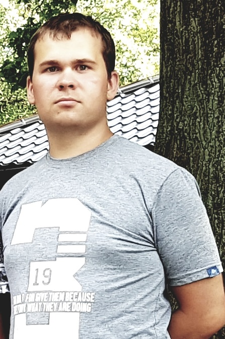

</img>
#Viktor Koshelev

##Contacs:
 * **Tel. №** +375 (29) 328-46-08 **(Viber, Teleram, WhatsApp)**;
 * **Skype:** vulpeskyuubi
 * **E-mail:** koshelevviktor92@gmail.com

##Summary:
I have good analytical skills. I am constantly updating my knowledge: I read 
technical literature, watch video tutorials on youtube. I’m looking for an 
opportunity that will allow me to use my knowledge in the field of information 
technology, to be creative and to improve myself. Excellent problem-solving skills 
and interpersonal skills. I set goals and persistently go to them!
	 
##Skills:
 * HTML
 * CSS
 * JS
 * GIT
 * C / C++
 * Database, SQL
 * JAVA

##Code examples:
```html 

<!DOCTYPE html>
<html>
  <head>
    <meta charset="UTF-8">
    <meta http-equiv="X-UA-Compatible" content="IE=edge">
    <title>Viktor Koshelev</title>
    <meta name="description" content="">
    <meta name="viewport" content="width=device-width, initial-scale=1">
    <link rel="stylesheet" type="text/css" href="style.css">
  </head>
  <body>
    <div class="container">
      <div class="name">
        <h2>Viktor Koshelev</h2>
       </div>
      <div class="photo"></div>   
      <div class="content">
        <h3>Contacs:</h3>
        <ul>
          <li><strong>Tel. №</strong> +375 (29) 328-46-08 <strong>(Viber, Teleram, WhatsApp)</strong>;</li>
          <li><strong>Skype:</strong> vulpeskyuubi;</li>
          <li><strong>E-mail:</strong> koshelevviktor92@gmail.com;</li>
        </ul>             
      </div>
    </div>
  </body>
</html>

```


##Experience:
  Thesis project "Development of an electronic work organization program"
##Education:
 * Mogilev State A. Kuleshov University, Department of Physics and Mathematics, mathematician - system programmer
 * [CSS and HTML codeacademy](https://www.codecademy.com/profiles/0127031500)
##English:
  A2 (Pre-Intermediate)